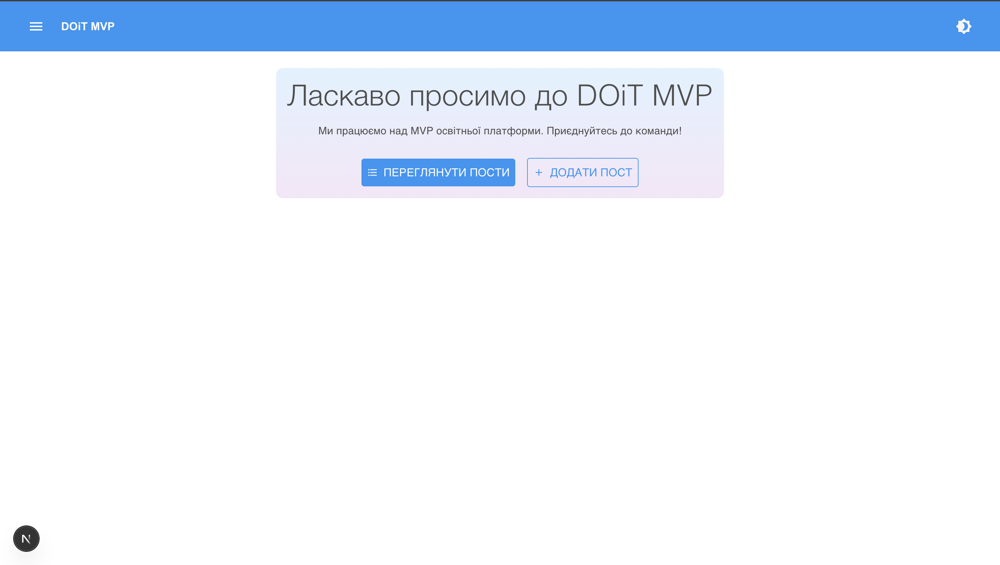
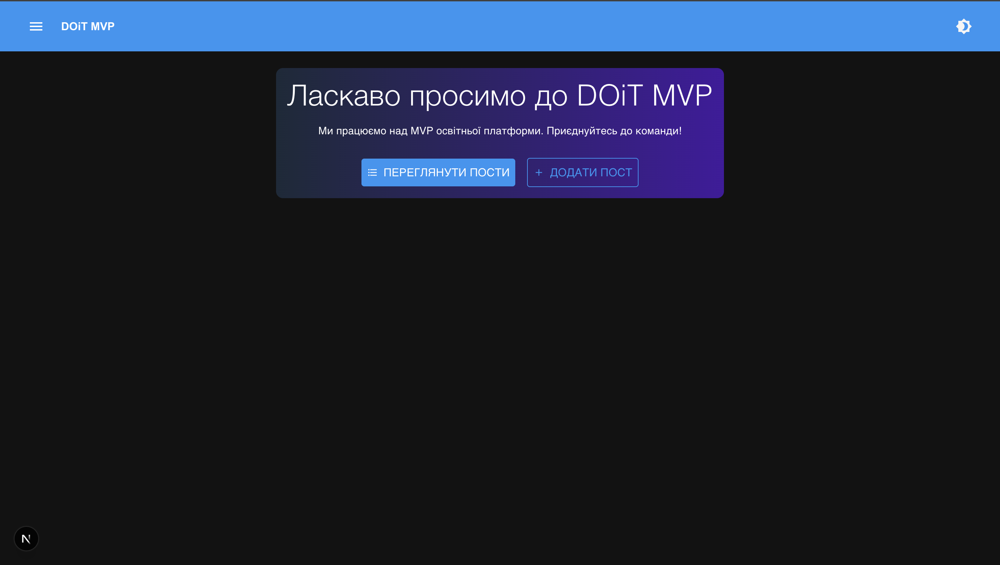
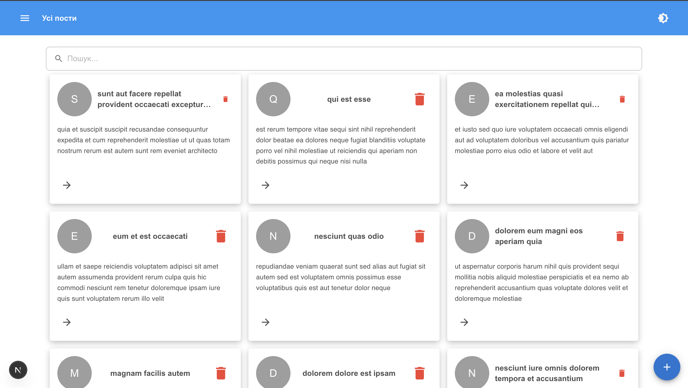
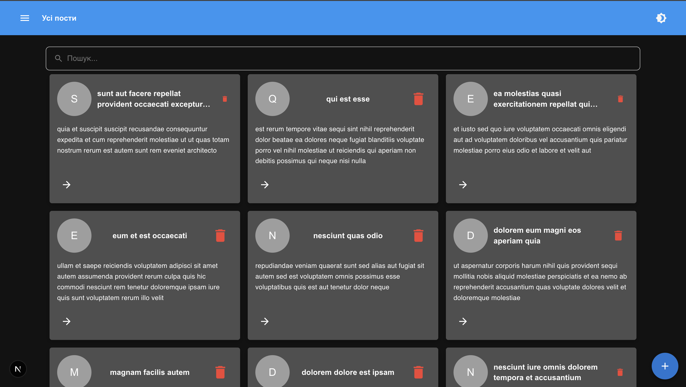
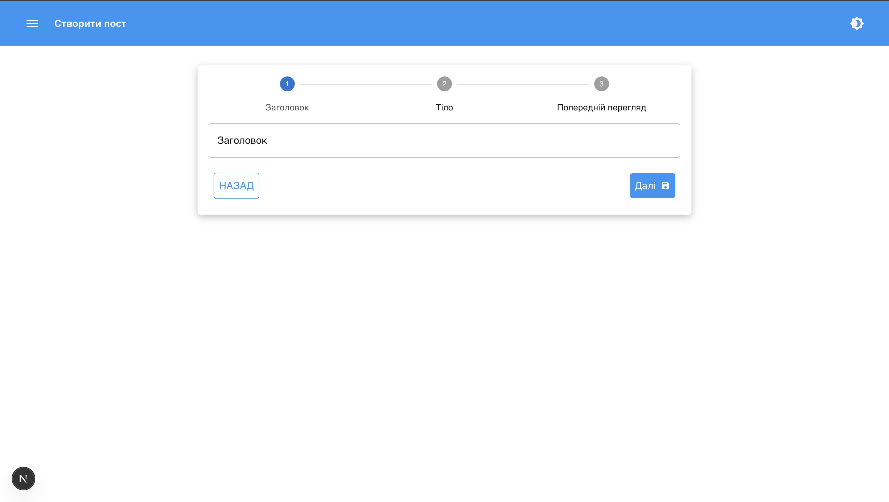
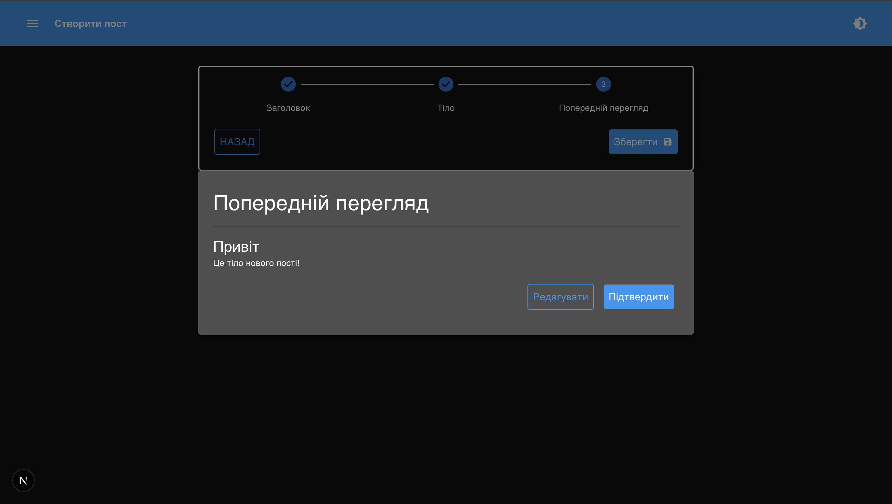

# 📝 Post Manager App

This is a small Next.js application for managing posts. You can:

- View all posts
- View a single post
- Create a new post
- Search posts by text

---

## 🚀 Getting Started

```bash
npm install
npm run dev

---

src/
├── app/            # Next.js routes and pages
├── assets/         # Images and icons
├── components/     # Reusable UI components
├── enums/          # Static enum values (e.g., message types)
├── hooks/          # Custom React hooks
├── libs/           # Utility functions (e.g., debounce)
├── providers/      # Context providers, themes, etc.
├── services/       # API logic (e.g., fetch posts)
├── store/          # Redux slices and state
├── types/          # Global TypeScript types

```


## 📸 Screenshots

### Home



### Posts



### Posts/[id]
![Posts/[id]](public/screenshots/detailed_light.png)
![Posts/[id]](public/screenshots/detailed_dark.png)

### Create



